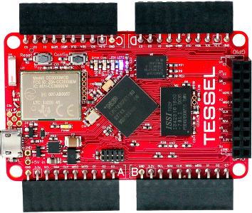
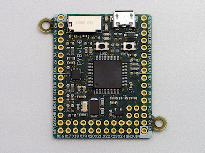
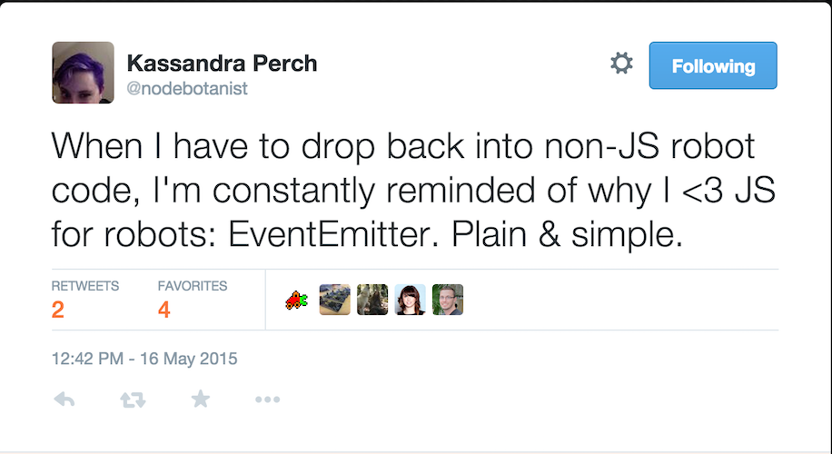

# Droids, JavaScript and Web Connected Hardware

<!-- .slide: class="title" -->

JSFoo India, September 19, 2015 <!-- .element: class="location" -->

Andrew Fisher @ajfisher <!-- .element: class="author" -->

Notes:
Hi! My name is Andrew Fisher and I'm a developer and member of the nodebots team. Today I
want to talk to you about Droids, JavaScript and Web Connected hardware for 
the next 25 minutes.

---

## Making things
<!-- .slide: data-background="/images/typewriter.jpg" -->


(CC) Flickr <!-- .element: class="attribution" -->
[Quasimodo](http://www.flickr.com/photos/quasimondo/5203908319)

Notes:
My initial interest in computing came from an interest in electronics. 
But the reality was that for a kid growing up in the late 80s, building serious 
hardware was prohibitively expensive and required facilities that most kids 
didn't have access to in those days. As a result, as a teen I moved to software 
where you could get better results and faster.

And this situation remained the case until recently.

---

## Hardware is becoming more like software 
<!-- .slide: data-background="/images/arduino_nano.jpg" -->

(CC) <!-- .element: class="attribution" -->
[Phil Farugia](#)

Notes:
Until this came along - this is an arduino and it has changed the way
hardware is thought of. Hardware was no longer expensive - these were
designed at the time to be less than 20 euros and the designs were open
sourced, meaning anyone could make them. Today you can get them for
$5. Sophisticated hardware became accessible to students, artists, kids and
web people. With it, this community has brought ideas around design, user experience, art and
software and architectural principles. 

Over the last few years, some great work has been done in the
node community getting JS to work with hardware like this

So today, I want to talk to you about that and how all of you can all start
working with hardware with JavaScript and we'll see some of the great things
the community has done along the way..

---

## TODO

1. Why use JS for robotics?
2. Introduction to the NodeBots stack
3. Applications and examples

Notes:
So to do this, we'll consider:

What makes JS good for hardware

We'll then look at the hardware stack

Then I'll show some examples and some demos

---


## Why use javascript for robotics?
<!-- .slide: data-background="/images/robot_johngreenaway.jpg" -->


(CC) Flickr <!-- .element: class="attribution" -->
[JohnGreenaway](https://www.flickr.com/photos/johngreenaway/3356358479/)

Notes:

So let's start by looking at what makes JS and hardware really powerful together.

--- 

### Real hardware engineers use C...




Notes:

In the hardware world, C has ruled for 30 years so there's an assumption that
all hardware must use C. This is still mostly the case - especially with older
or cheaper chips. However the next generation of medium cost chips are more or
less here now that can run python and JavaScript natively on the board. 

---

### Why use JS and hardware?
<!-- .slide: data-background="/images/atmega.jpg" -->

(CC) Flickr <!-- .element: class="attribution" -->
[Oskay](http://www.flickr.com/photos/oskay/2310115216/)

Notes:

So why use JavaScript compared to some other high level language.

For me it's mainly because of JS' event handling and ptototypical inheritance.

---

### EventEmitter



Twitter: <!-- .element: class="attribution" -->
[@nodebotanist](http://twitter.com/nodebotanist)

Notes:

JavaScript has incredible event handling. We tend to take this for granted, as
wel developers. If you work in NodeJS then you have probably worked with EventEmitter 
and it's just amazing at allowing different parts of your application to talk to 
each other. This is really useful in the hardware world.

---

### The real world is all events
<!-- .slide: data-background="/images/door.jpg" -->

(CC) Flickr <!-- .element: class="attribution" -->
[txmx 2](https://www.flickr.com/photos/txmx-2/8535263071)

Notes:

When you're designing something to work in the real world thinking about events
makes so much sense that it makes your code very clean, modular and responsive.

Say you are designing a door entry system with a card. In JS we simply define
an event listener and wait for the card swipe to occur with the detals of the
card and then handle it. We can do the same thing in C but we write a lot of
code, have to use interrupt handlers and make sure we suspend the system state
properly or our door will crash.

JS is designed to just work with this sort of behaviour.

---

### Prototypes provide flexibility

```
var left_motor = new Five.motor({controller: 'I2C'});
var right_motor = new Five.motor({controller: 'PCA34567'});

left_motor.start = function(speed) {
    // make double speed 
    this.speed = 2*speed;
};

left_motor.start();
right_motor.start();

```

Notes:

The other feature that is awesome for hardware is JS's prototypical inheritance. 

Being able to define a shape of an api for an object in hardware and then 
dynamically bring in a controller to deal with the implementation details allows
us to work with many different types of hardware effortlessly such as these 
motors here.

As an end user of the API you don't need to worry about what happens down low,
You can just write code to start the motor turning and pass a speed in.

But also it means if you have a specific case you need to address, you can 
extend or redefine the object with your own controller say like making the
motor turn twice as fast or something.

This makes prototyping much much faster but it also means we can create common
structures for components in a way that's almost impossible in C.

---

### JS <3 Robotics
<!-- .slide: data-background="/images/robot_love.jpg" -->

(CC) Flickr <!-- .element: class="attribution" -->
[hiperbolica](https://www.flickr.com/photos/hiperbolica/3414999010)

Notes:

So Javascript is well suited I think to working with hardware, so let's take a 
look at what the hardware stack looks like.

---

## The NodeBots stack


Notes:

Nodebots is what we call JavaScript working with Hardware through NodeJS.
The core of NodeBots is really transport protocols to allow us to talk over
USB, wireless or serial connections. 

Then, wrapped around this we have a framework called Johnny Five.

---

## Johnny Five
<!-- .slide: data-background="/images/rick.jpg" -->

(C)<!-- .element: class="attribution" -->
[Joanne Daudier](https://twitter.com/jdaudier)

Notes:

Johnny Five abstracts hardware into components that behave the same way regardless
of the controller for the hardware and the board that you're using it on. 
This allows you to concentrate on building great things and allows you to 
prototype very rapidly.

Johnny Five was started by this guy - Rick Waldron, and there's now many 
members of the core team who work on this from all around the world.

---

### The stack

* Controller board (sensors and actuators)
* IO Plugin (communications protocol)
* Johnny Five / NodeJS (application logic)
* WS/HTTP (networking and security protocols)
* Clients (UI, input, visualisation)

Notes:

So this is what the typical JS hardware stack looks like. 

We have a board which could have sensors and actuators. Most controller boards 
can't run JS yet so we normally need to put some firmware on them to do what we want.

This talks via a communications protocol to what is called an IO Plugin. IO
plugins are a Johnny Five idea that tries to get hardware to behave in consistent
ways via a protocol 

Johnny Five gives us abstraction on components so we can turn motors and LEDs into 
JavaScript objects and interact with them consistently. 

As a side effect we get all of NodeJS as well so that means we can start doing 
interesting things like linking up with our normal web protocols. 
And then finally we can add clients for things like UI and what not.

---

### Common implementation

* Controller board (Arduino)
* IO Plugin (Firmata over USB)
* Johnny Five / NodeJS (application logic)
* WS/HTTP (networking and security protocols)
* Clients (UI, input, visualisation)

Notes:

So in practice this is what a specific implementation of this stack looks like.
You can see we've got an arduino board in this case and the IO Plugin is 
a firmware called Firmata which provides us the interface to the board for Johnny
Five. This is about the most basic and most common stack you can use but you can
see that the bit we are concerned about - being the bit in the middle pretty
much stays the same all the time.

---

### Installation 

* Board development environment (eg Arduino)
* Flash board with protocol (eg Firmata)
* npm install johnny-five
* Write code
* ...
* Make an awesome robot

Notes:

So to get up and running, it's pretty much just a case of getting the board dev
environment going. For arduino that's prerry much just download the arduino
IDE and install it. You then put the IO protocol on the board that you need - 
for an arduinon that just means using Firmata and then it's an npm install
and you are then writing code.

---

## Examples and applications
<!-- .slide: data-background="/images/np_glasses.jpg" -->

Glasses (C)<!-- .element: class="attribution" -->
[Andy Gelme](https://twitter.com/geekscape) | 
Image (CC) [Matthew Bergman](7215764961901652://www.flickr.com/photos/matthewbergman/15337663413/)

Notes:

With all this power, what sort of things can you build? Well I'm going to show
you some examples of some fun things people have made and show you some code
as well. 

---

### Node Skirt
<!-- .slide: data-background="/images/skirt.jpg" -->

Skirt (C)<!-- .element: class="attribution" -->
[Kassandra Perch](https://twitter.com/nodebotanist) | 
Image (CC) [Matthew Bergman](https://www.flickr.com/photos/matthewbergman/15969524882/in/set-72157649619016521)

Notes:

This skirt, made by Kassandra Perch is fully contained running javascript on a little board embedded into
it. It has an accelerometer and as you move around the LEDs inside it light up
different colour. So you can even use JavaScript in your clothing!!


---

### Tetris
<!-- .slide: data-background="/images/tetris.gif" -->

(C)<!-- .element: class="attribution" -->
[Adrian Catalan](https://twitter.com/ykro)

Notes:

Here is an example by Adrian Catalan of using nodeJS to make a physical game. 

---

### Tharp
<!-- .slide: data-background="/images/tharp.gif" -->

(OSC)  <!-- .element: class="attribution" -->
[dtex](https://github.com/dtex/tharp)

Notes:

Donovan Buck has done a lot of work on making sophisticated animation control
in nodebots with a library to solve inverse kinematics problems. Here you 
can see he has attached a 6-leg robot to a leap motion for hand control and it
responds very very fast to his movement. 

---

### Hello World
<!-- .slide: data-background="/images/hello_world.jpg" -->

(CC) Flickr <!-- .element: class="attribution" -->
[Daniel Novta](http://www.flickr.com/photos/vanf/5210360116)

Notes:

So now you've seen some examples, let's see a demonstration. With hardware you 
most of the time don't have a screen. So a hello world example is just getting
an LED to blink on and off.

---

### Circuit


Notes:

We will use an arduino and we're just going to plug an LED into this pin 10 here.
The arduino will run firmata like I described before and then we'll use Johnny
Five to control it all.

---

### Hardware hello world

```
var five = require("johnny-five");

if (process.argv[2] == null) {
    console.log("You need to supply a device to connect to");
    process.exit()
}

var board = five.Board({port: process.argv[2]});

board.on("ready", function() {

    var led = new five.Led(10);
    led.blink(500);

});
```

Notes:

So here's the code to make this work. You can see here that I have the board 
connect and then when it is ready the callback fires and I have a simple call to
blink every 500ms. This is a convenience method which just sets a timer interval
and then calls it.


---

### Demonstration
<!-- slide: data-background="/images/blinkled.gif" -->

<!-- Image of live demonstration. -->

Code: <!-- .element: class="attribution" -->
[ led.js](/code/led.js)

Notes:

So let's see that work.

Easy right - that is like the blink tag in hardware!!

---

### Web page LED

```
var five = require("johnny-five");

if (process.argv[2] == null) {
    console.log("Please supply a device to connect to");
    process.exit();
}

// web server elements
var express = require('express');
var app = express();
var http = require('http');
var server = http.createServer(app);
var board;

// Set up the application server
app.configure(function() {
    app.set('port', 8001);
    app.use(app.router);
    app.use(express.static(__dirname + '/public'));
});

server.listen(app.get('port'));

// Set up Socket IO
var io = require('socket.io').listen(server);
io.set('log level', 1);

console.log("MESSAGE: Web server now listening");

app.get('/', function(request, response) {
    response.sendfile(__dirname + '/public/index.html');
});

io.sockets.on("connection", function(socket) {

    if (board.ready) {
        socket.emit("connect_ack", {msg: "Welcome ", state: "ONLINE"});
    } else {
        socket.emit("connect_ack", {msg: "Welcome", state: "NOPINS"});
    }

    socket.on("toggle", function(data) {
        // use the control mech to switch the LED on or off
        board.digitalWrite(pin, data.state);
    });
});

// SET up the arduino and firmata
var pin = 10; // led pin to turn on.
board = new five.Board(process.argv[2], function(err) {
    if (err){
        console.log(err);
        process.exit();
    }
    console.log("Control via your browser now");
});
```

Notes:

So that's great but what about if you want something connected to the browser?

We'll use the same circuit but this time we can use express to make a web page.
You can see here the code is mostly just setting up page routes and then we
use web sockets to send a message when the button is clicked.

After that it's mostly just the same code as before. Connect to the board and
make it respond to a message.

---

### Web connected light
<!-- slide: data-background="/images/webled.gif" -->

<iframe class="external" src="http://localhost:8001/"></iframe>

<!-- Image of live demonstration. -->
Code: <!-- .element: class="attribution" -->
[ webled.js](/code/led.js)

Notes:

So here it is working - as I click the button the LED turns on and off. All with
JavaScript and a little bit of hardware.

---

### mBot
<!-- .slide: data-background="/images/mbot.jpg" -->

(CC) <!-- .element: class="attribution" -->
[AJ Fisher](http://twitter.com/ajfisher)

Notes:

This final demonstration is a little more complex. This is an mBot by a company
called MakeBlock.

They have many features, including motors, sensors and can use bluetooth and wifi too.

---

### mBot drive code

```
var five = require("johnny-five");

var max_speed_l = 150;
var max_speed_r = 140;

// set up the input
var stdin = process.openStdin();
require('tty').setRawMode(true);

var board = new five.Board({port: process.argv[2]});

var l_motor = r_motor = null;

board.on("ready", function(err) {

    if (err){
        console.log(err);
        return;
    }
    l_motor = new five.Motor({pins: {pwm: 6, dir: 7}});
    r_motor = new five.Motor({pins: {pwm: 5, dir: 4}});

    console.info("Board connected. Robot set up. LRUD to control");

});

stdin.on('keypress', function(chunk, key) {
	// process the keypresses

	if (key) {
		switch (key.name) {
			case "up":
                l_motor.reverse(max_speed_l);
                r_motor.forward(max_speed_r);
				break;
			case "down":
                r_motor.reverse(max_speed_r);
                l_motor.forward(max_speed_l);
				break;
			case "left":
                l_motor.forward(max_speed_l);
                r_motor.forward(max_speed_r);
				break;
			case "right":
                r_motor.reverse(max_speed_r);
                l_motor.reverse(max_speed_l);
				break;
			case "space":
                l_motor.stop();
                r_motor.stop();
				break;
		}
	}
});

```

Notes:

This code is a little long but mostly it creates a board and then uses the key
presses of a keyboard to then say to drive forwards, backwards, left and right
and turns the motors on and off in the right combinations to do this. Even
though there is some code it is very simple. 


---

### Demonstration
<!-- .slide: data-background="/images/mbot.gif" -->

Image of alternative demonstration. Code: <!-- .element: class="attribution" -->
[mbot.js](/code/led.js)

Notes:

Let's see this drive. Hopefully this will work.

So this is just running over bluetooth and is controlled from javascript.

---

## Resources

* johnny-five.org
* gitter.im/rwaldron/johnny-five
* node-ardx.org
* Make JS Robotics book ("MAKEJS" 15% off at MakerShed.com)

Notes:

Finally, here are some resources to get more information and if you want to get
a book on all of this, there is a code there to get a discount. This was
written by the core NodeBots group and has lots of fun projects in it for you
to build.

---

# Droids, JavaScript and Web Connected Hardware

<!-- .slide: class="title" -->

JSFoo India, September 19, 2015 <!-- .element: class="location" -->

Andrew Fisher @ajfisher <!-- .element: class="author" -->

Notes:

So hopefully that gives you a good view of why you would use JS, what the stack
looks like and also some inspiration for things you can do with it.

thank you very much and please come talk to me if you want to find out any more

